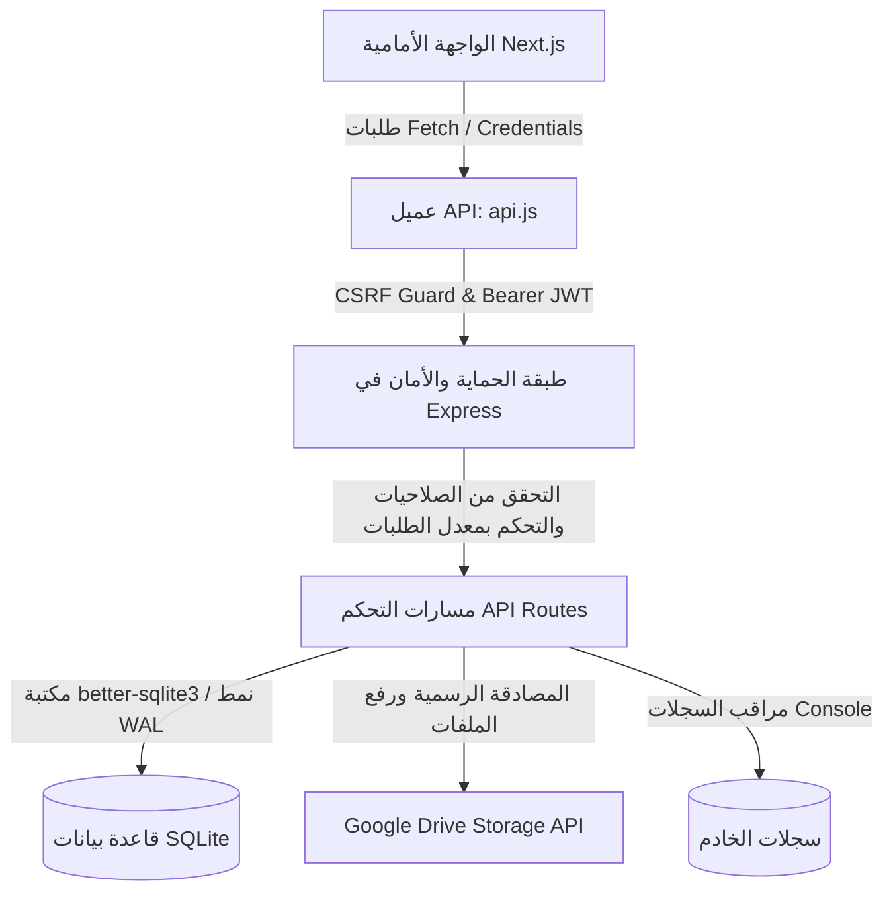

# دليل منصة إدارة التعلم (LMS Platform) 🎓

مرحبًا بك في منصة إدارة التعلم (LMS) المتكاملة والمصممة لتسليم المهام والتحكم بالحضور والتقييمات للطلاب والمحاضرات بشكل آمن، مرن، وقابل للتشغيل في بيئات الإنتاج (Production-Grade).

---

## 🗺️ معمارية النظام (System Architecture)

يعتمد النظام على فصل الواجهة الأمامية عن الخلفية (Decoupled client-server architecture) مع قنوات اتصال مؤمنة:



---

## 🛠️ التقنيات المستخدمة (Tech Stack)

تم بناء المنصة باستخدام هندسة برمجية متطورة تفصل بين الواجهة الأمامية والخلفية:

### 1. الواجهة الأمامية (Frontend)
- **الإطار الأساسي:** [Next.js](https://nextjs.org/) (React) مع الالتزام بـ App Router.
- **التصميم والتنسيق:** Vanilla CSS بالكامل لتوفير مرونة وتحكم كامل، مع واجهات وتأثيرات بصرية متقدمة (Dark Mode, Glassmorphism, Micro-animations).
- **إدارة الاتصالات:** عميل API ذكي ومخصص (`client/src/lib/api.js`) يدعم:
  - تمرير الكوكيز بشكل آمن في بيئات التطوير والإنتاج (`credentials: 'include'`).
  - طابور Verification تلقائي لتجديد جلسة العمل (Token Refresh Queue) عند انتهاء صلاحية الـ Access Token دون أن يشعر المستخدم.
  - حماية مدمجة ضد هجمات CSRF عبر ترويسات مخصصة.
  - مؤشرات رفع مرئية ديناميكية عبر استخدام `XMLHttpRequest.upload`.

### 2. الواجهة الخلفية (Backend)
- **بيئة التشغيل:** Node.js مع إطار العمل [Express.js](https://expressjs.com/).
- **إدارة الملفات والرفع:** `multer` لمعالجة الرفع المؤقت في الذاكرة مع فحص نوع الملفات وامتداداتها لمنع رفع السكريبتات الضارة.
- **قاعدة البيانات:** SQLite مدارة عبر المكتبة فائقة السرعة `better-sqlite3` مع تفعيل نمط WAL (Write-Ahead Logging) لضمان أداء ممتاز مع الاتصالات المتزامنة وتفعيل القيود المرجعية (Foreign Keys).

---

## 📁 هيكل المجلدات (Folder Structure)

يتميز المشروع بهيكل تنظيمي بسيط ومقسّم بعناية:

```txt
MVC/
├── backups/               # ملفات النسخ الاحتياطي التلقائي لقاعدة البيانات (*.db, *.json)
├── client/                # تطبيق Next.js للواجهة الأمامية
│   ├── src/
│   │   ├── app/           # صفحات التطبيق (الصفحة الرئيسية، لوحة الإدارة، لوحة الطالب)
│   │   ├── components/    # المكونات القابلة لإعادة الاستخدام (الحضور، الطلاب، الواجبات)
│   │   └── lib/
│   │       └── api.js     # عميل الشبكة الموحد والآمن
│   └── package.json
├── logs/                  # سجلات النظام وأخطاء التشغيل
├── services/
│   ├── logger.js          # نظام تسجيل أحداث بسيط وموحد
│   └── storage.js         # الربط والرفع على Google Drive API
├── database.js            # إعداد جداول قاعدة البيانات والعمليات الأساسية المساعدة
├── server.js              # نقطة الدخول الرئيسية للخلفية والإعدادات الأمنية
├── package.json
└── README.md              # هذا الملف التوضيحي
```

---

## 🔒 نموذج التهديدات والحماية (Threat Model & Security Considerations)

تم تصميم النظام مع مراعاة أعلى معايير الحماية والتصدي للهجمات السيبرانية:

- **الوقاية من هجمات XSS:**
  - يتم تعقيم جميع مدخلات المستخدم النصية باستخدام دالة `sanitize` البرمجية على السيرفر قبل تخزينها في قاعدة البيانات أو معالجتها.
- **الوقاية من هجمات CSRF:**
  - يتم فرض فحص وجود ترويسة `X-Requested-With: XMLHttpRequest` مخصصة على جميع مسارات تبادل الكوكيز (`POST /api/auth/refresh`).
  - يتم مطابقة ترويسات الـ `Origin` والـ `Referer` على السيرفر للتأكد من أن الطلب نشأ من النطاق المسموح به والموثوق فقط.
- **منع هجمات التكرار (Replay Attack Prevention):**
  - تفعيل آلية **Refresh Token Rotation (RTR)**؛ حيث يتم حذف توكين التحديث القديم فور استخدامه وتوليد توكين جديد تمامًا وجلسة جديدة، مما يلغي تمامًا إمكانية إعادة استخدام التوكينات القديمة حتى لو تم اعتراضها.
- **إدارة ملفات تعريف الارتباط الآمنة (Secure Cookie Handling):**
  - إرسال كوكيز جلسة العمل مع خاصيتي `HttpOnly` و `SameSite=Lax` لمنع الوصول إليها عبر أي سكربت خبيث (منع سرقة الجلسة). وفي بيئات الإنتاج يتم إجبار خاصية `Secure` لتسير الطلبات عبر HTTPS فقط.
- **التحكم بمعدل الطلبات (Rate Limiting):**
  - حماية مسارات الخادم من هجمات الحرمان من الخدمة (DoS) وتخمين كلمات المرور عبر تحديد معدلات الطلب لكل عنوان IP.

---

## 📡 توثيق مسارات API الرئيسية (API Endpoints)

### 1. تسجيل الدخول
* **المسار:** `POST /api/login`
* **معدل الطلب:** 5 محاولات كحد أقصى لكل 15 دقيقة.
* **صلاحيات الدخول:** عام (مفتوح للجميع).
* **بيانات الطلب (Body):**
  ```json
  {
    "username": "admin",
    "password": "your_secure_password"
  }
  ```
* **نموذج الاستجابة الناجحة:**
  ```json
  {
    "user": {
      "id": 1,
      "name": "مدير النظام",
      "username": "admin",
      "role": "admin",
      "points": 0
    },
    "token": "eyJhbGciOiJIUzI1NiIsInR5cCI6IkpXVCJ9..."
  }
  ```

### 2. تدوير وتحديث التوكين
* **المسار:** `POST /api/auth/refresh`
* **صلاحيات الدخول:** يتطلب إرسال كوكيز الـ `refreshToken` بشكل صحيح.
* **الحماية:** يتطلب وجود ترويسة `X-Requested-With: XMLHttpRequest`.
* **نموذج الاستجابة الناجحة:**
  ```json
  {
    "accessToken": "eyJhbGciOiJIUzI1NiIsInR5cCI6IkpXVCJ9..."
  }
  ```

### 3. تسليم تكليف (واجب) جديد للطلاب
* **المسار:** `POST /api/submissions`
* **صلاحيات الدخول:** طلاب مسجلين فقط (`role: student`).
* **بيانات الطلب (Body):**
  ```json
  {
    "taskId": 1,
    "fileUrl": "https://example.com/my-submission.zip"
  }
  ```
* **نموذج الاستجابة الناجحة:**
  ```json
  {
    "message": "تم تسليم المهمة بنجاح، في انتظار تقييم المعلم"
  }
  ```

### 4. إلغاء تسليم واجب
* **المسار:** `DELETE /api/submissions/:taskId`
* **صلاحيات الدخول:** للطلاب فقط (`role: student`).
* **نموذج الاستجابة الناجحة:**
  ```json
  {
    "message": "تم إلغاء التسليم بنجاح"
  }
  ```

---

## ⚡ ملاحظات الأداء (Performance Notes)

- **قاعدة البيانات SQLite + WAL:**
  - تم تهيئة قاعدة البيانات SQLite للعمل بنمط **WAL (Write-Ahead Logging)** لتمكين القراءة المتزامنة المتعددة أثناء عمليات الكتابة دون حدوث أقفال لقاعدة البيانات (Database Locks).
  - استخدام العلاقات المفتاحية الخارجية المباشرة لضمان تكامل البيانات واستخدام الفهارس التلقائية لعمليات الاستعلام السريعة.
- **إدارة رفع الملفات الذكي:**
  - يتم استخدام الرفع المؤقت بالذاكرة (Memory Storage Buffer) لمعالجة الملفات المرفوعة إلى Google Drive بشكل مباشر كتيار بيانات (Buffer Stream) دون استهلاك مساحات تخزين مؤقتة على القرص الصلب الخاص بالخادم.

---

## ⚠️ تنبيهات أمنية هامة (Security Notes)

> [!WARNING]
> **إدارة ملفات الاعتماد الخاصة بـ Google Drive OAuth2:**
> - لا تقم أبدًا برفع ملفات الإعدادات الحساسة أو قيم متغيرات البيئة (`GOOGLE_CLIENT_ID`, `GOOGLE_CLIENT_SECRET`, `GOOGLE_REFRESH_TOKEN`) إلى مستودعات Git العامة. احتفظ بها دائمًا داخل ملف `.env` وقم بإضافته لـ `.gitignore`.

> [!CAUTION]
> **صلاحيات ملفات Google Drive:**
> - يعتمد النظام على رفع ملفات الطلاب إلى مجلد Google Drive مشترك. تأكد من إعداد مجلد Google Drive المخصص ليكون **متاحًا للوصول عبر الرابط (Anyone with link can view)** لتسهيل استعراض الواجبات وتقييمها من قبل المشرفين، دون جعل المجلد بالكامل عامًا للبحث لتجنب تسريب ملفات الطلاب.

> [!IMPORTANT]
> **مفتاح التشفير العام (`SECRET_KEY`):**
> - في بيئة الإنتاج (Production)، يتوقف النظام تلقائيًا عن العمل إذا تم الكشف عن غياب قيمة `SECRET_KEY` أو استخدام مفتاح ضعيف، وذلك لحماية توقيع توكينات الـ JWT من التزوير.

---

## 💾 النسخ الاحتياطي التلقائي وسجل الأحداث

### 🛠️ نظام تسجيل الأحداث والتدقيق (Logging & Audit)
يعتمد الخادم على نظام تسجيل أحداث (Logger) خفيف ومبسط لإخراج سجلات التشغيل:
- **سجلات التشغيل (Stdout/Stderr):** يتم إخراج السجلات بشكل موحد مع إمكانية توجيهها لملفات التشغيل عبر سكريبتات أو مديري العمليات (مثل PM2).
- **سجل التدقيق (Audit Trail):** يسجل العمليات الحساسة مثل تسجيل الدخول، وتغيير كلمات المرور، وحذف الطلاب، وتعديل الحضور في جدول `audit_logs` بقاعدة البيانات مباشرة لتوثيق إجراءات الإدارة ومتابعتها.

### 💾 النسخ الاحتياطي التلقائي (SQLite Auto-Backup)
- يتم أخذ نسخة احتياطية من قاعدة البيانات تلقائيًا فور تشغيل التطبيق (Startup Backup) ثم تتكرر العملية **كل 24 ساعة**.
- تعتمد العملية على أداة النسخ الاحتياطي المدمجة غير الحاجبة للأداء `db.backup()` من مكتبة `better-sqlite3`.
- يتم الاحتفاظ بآخر **10 نسخ احتياطية فقط** في مجلد `backups/` ويتم حذف القديم تلقائيًا لمنع امتلاء القرص.

---

## 🚀 النشر في بيئات الإنتاج (Production Deployment Guide)

لتشغيل التطبيق في بيئة إنتاجية حقيقية (مثل VPS أو Railway أو Heroku):

### 1. إعداد خادم VPS مع PM2 و Nginx
1. قم بتثبيت Node.js وقاعدة البيانات على الخادم.
2. قم بتثبيت مدير العمليات PM2 لتشغيل السيرفر في الخلفية وإعادة تشغيله تلقائيًا عند الأعطال:
   ```bash
   npm install pm2 -g
   pm2 start server.js --name "lms-backend"
   ```
3. قم بتهيئة Nginx ليعمل كخادم وكيل عكسي (Reverse Proxy) لتوجيه حركة المرور الخارجية المنفذ 80/443 إلى المنفذ الداخلي للتطبيق (مثل 5000) مع تفعيل شهادة SSL/TLS مجانية عبر Let's Encrypt.
4. تأكد من تفعيل ترويسة تمرير عنوان الـ IP الحقيقي للعميل في إعدادات Nginx:
   ```nginx
   proxy_set_header X-Real-IP $remote_addr;
   proxy_set_header X-Forwarded-For $proxy_add_x_forwarded_for;
   ```

### 2. متغيرات البيئة للإنتاج (Environment Variables)
يجب توفير المتغيرات التالية بدقة في خادم الإنتاج:
```env
PORT=5000
NODE_ENV=production
SECRET_KEY=A_Very_Long_Random_And_Secure_String_Here_123!
GOOGLE_CLIENT_ID=your_google_client_id.apps.googleusercontent.com
GOOGLE_CLIENT_SECRET=your_google_client_secret
GOOGLE_REFRESH_TOKEN=your_google_refresh_token
GOOGLE_DRIVE_FOLDER_ID=your_google_drive_folder_id
ALLOWED_ORIGINS=https://lms.yourdomain.com
```

---

## 🛠️ حل المشكلات الشائعة (Troubleshooting)

* **فشل رفع الملفات للتسليمات (Google Drive upload fails):**
  - **السبب:** عدم ضبط متغيرات بيئة OAuth2 بشكل صحيح، أو انتهاء صلاحية الـ Refresh Token، أو عدم تفعيل Google Drive API في مشروع Google Cloud.
  - **الحل:** تأكد من إعداد قيم `GOOGLE_CLIENT_ID`, `GOOGLE_CLIENT_SECRET`, و `GOOGLE_REFRESH_TOKEN` بدقة في ملف `.env`. تأكد من تفعيل Google Drive API في Google Cloud Console، وإذا لزم الأمر، أعد توليد Refresh Token جديد باستخدام السكريبت المرفق.

* **جلسة المستخدم تنتهي بسرعة أو تفشل الطلبات المتتالية:**
  - **السبب:** انتهاء صلاحية الـ Access Token وفشل الواجهة الأمامية في إرسال طلب التحديث لعدم وجود ترويسة الحماية.
  - **الحل:** تأكد من أن تطبيق العميل يقوم بتمرير الترويسة `X-Requested-With: XMLHttpRequest` مع طلبات تحديث التوكين، وتأكد من سماح الـ CORS للنطاق بالوصول للـ Cookies.

* **ظهور خطأ CORS blocked:**
  - **السبب:** النطاق (Domain) الذي يرسل الطلب ليس مدرجًا في قائمة النطاقات المسموحة `ALLOWED_ORIGINS` على السيرفر الخلفي.
  - **الحل:** أضف النطاق الفعلي للموقع بدقة في ملف الـ `.env` الخاص بالسيرفر الخلفي وأعد التشغيل.

---

## ⚙️ التثبيت والتشغيل المحلي (Installation & Setup)

### المتطلبات الأساسية
- Node.js إصدار v18 أو أحدث.

### 1. إعداد الواجهة الخلفية (Backend)
انتقل إلى جذر المشروع وقم بتثبيت الحزم:
```bash
npm install
```
اضبط قيم ملف `.env` بناءً على `.env.example`.

#### 🔑 إعداد Google Drive عبر OAuth2 وتوليد الـ Refresh Token:
1. اذهب إلى [Google Cloud Console](https://console.cloud.google.com/).
2. أنشئ مشروعًا جديدًا وقم بتفعيل **Google Drive API** له.
3. اذهب إلى شاشة **OAuth consent screen**، اختر **External**، واملأ البيانات الأساسية. في خطوة الـ Scopes، أضف النطاق التالي:
   - `https://www.googleapis.com/auth/drive` (للتحكم بالملفات المرفوعة إلى المجلد المخصص).
4. اذهب إلى **Credentials** -> **Create Credentials** -> **OAuth client ID**.
5. اختر نوع التطبيق **Desktop Application** ثم اضغط **Create**.
6. انسخ الـ `Client ID` والـ `Client Secret` وضعهما في ملف `.env` كـ:
   - `GOOGLE_CLIENT_ID`
   - `GOOGLE_CLIENT_SECRET`
7. قم بتشغيل سكريبت التوليد التفاعلي المرفق في المشروع:
   ```bash
   node scripts/generate-google-refresh-token.js
   ```
8. اتبع التعليمات التي تظهر في الواجهة التفاعلية (افتح الرابط في المتصفح، سجل الدخول واقبل الصلاحيات، ثم انسخ كود التفويض أو رابط إعادة التوجيه بالكامل وضعه في السكريبت).
9. سيقوم السكريبت بإعطائك قيمة الـ `GOOGLE_REFRESH_TOKEN` لتقوم بنسخها ووضعها في ملف `.env`.

ابدأ تشغيل السيرفر الخلفي:
```bash
npm start
```

### 2. إعداد الواجهة الأمامية (Frontend)
انتقل إلى مجلد الـ `client`:
```bash
cd client
npm install
```
قم بتشغيل خادم التطوير لـ Next.js:
```bash
npm run dev
```
افتح متصفحك على الرابط [http://localhost:3000](http://localhost:3000).

---

## 📈 بيانات الدخول التجريبية الآمنة (Demo Accounts)
عند تشغيل التطبيق لأول مرة على قاعدة بيانات فارغة، يتم إنشاء حسابين تجريبيين تلقائيًا:
1. **حساب الإدارة (Admin):**
   - اسم المستخدم: `admin`
   - كلمة المرور: `AdminLms2026!`
2. **حساب الطالب (Student):**
   - اسم المستخدم: `student`
   - كلمة المرور: `StudentLms2026!`

---

## 📄 الترخيص (License)
هذا المشروع مرخص بموجب ترخيص **MIT** - راجع ملف الترخيص لمزيد من التفاصيل.
